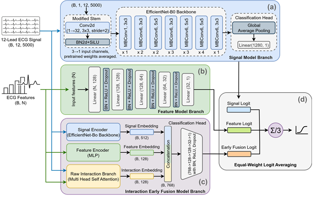
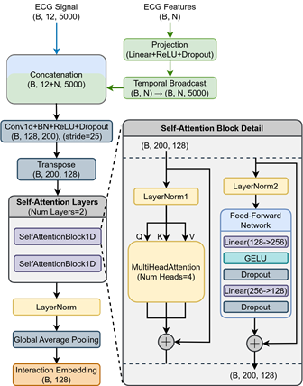
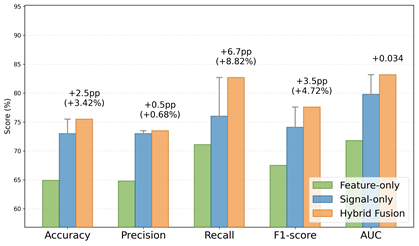
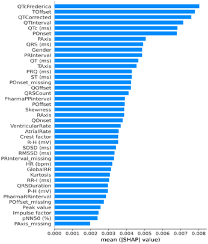

# A Hybrid Fusion Multimodal Framework for Stroke Classification Using ECG Signals and Measurements

> **ECG 신호 및 측정값을 활용한 뇌졸중 분류용 하이브리드 퓨전 멀티모달 프레임워크**  
> So-Yun Im, Master's Thesis, Department of Computer Engineering, Hallym University, 2026

## Overview

본 연구는 하나의 10초 12-lead ECG에서 얻을 수 있는 두 가지 정보인 **원시 ECG 신호**와 **ECG 기반 정량 피처**를 함께 활용하여 뇌졸중 관련 패턴을 분류하는 하이브리드 퓨전 멀티모달 프레임워크를 제안합니다.

원시 신호는 파형의 시간적·형태적 패턴을 제공하고, ECG 피처는 QT 간격, 파형 기준점, 전기축과 같은 정량적 정보를 제공합니다. 제안 모델은 두 표현을 early fusion 단계에서 결합하고, 각 브랜치의 예측을 late fusion 단계에서 다시 통합합니다.

주요 결과는 다음과 같습니다.

- Hybrid Fusion: **AUC 0.832**, **Recall 82.7%**, **F1-score 77.6%**, **Brier score 0.169**
- Signal-Only 대비 AUC **+0.034**, Recall **+6.7%p**, F1-score **+3.5%p**
- 민감도 90% 기준 FPR: **52.7% → 45.2%**
- Pooled 예측 기반 DeLong 검정에서 AUC 향상 확인: **ΔAUC 0.036, p < 0.001**

## Motivation

ECG 신호만 사용하는 모델은 파형의 복잡한 패턴을 직접 학습할 수 있지만, 장비에서 계산된 주요 간격과 축 정보 등을 명시적으로 활용하지 못합니다. 반대로 ECG 피처만 사용하는 모델은 정량 지표를 활용할 수 있지만 원시 파형의 세부적인 형태를 잃게 됩니다.

본 연구의 핵심 질문은 다음과 같습니다.

> 동일한 ECG에서 얻은 원시 파형과 정량 피처를 상호보완적으로 결합하면, 신호만 사용하는 모델보다 뇌졸중 분류 성능을 향상시킬 수 있는가?

## Framework



*Overall architecture of the proposed Hybrid Fusion framework.*

### 1. Signal Model Branch

- 입력: 10초, 500 Hz의 12-lead ECG (`1 x 12 x 5000`)
- Backbone: ImageNet 사전학습 **2D EfficientNet-B0**
- 입력층의 3채널 가중치를 평균하여 1채널 입력층으로 변환
- Global Average Pooling으로 얻은 1280차원 표현에서 Signal Logit 산출
- Early Fusion에서는 이 표현을 512차원 Signal Embedding으로 변환

### 2. Feature Model Branch

- 입력: 최종 선정된 **41개 ECG 피처**
- MLP hidden dimensions: `128 -> 128 -> 64 -> 32`
- Batch Normalization, ReLU, Dropout(0.2) 적용
- 128차원 Feature Embedding과 Feature Logit 산출

### 3. Interaction Early Fusion

Interaction Early Fusion은 다음 세 표현을 결합합니다.

- Signal Embedding: 512차원
- Feature Embedding: 128차원
- Interaction Embedding: 128차원

Raw Interaction Branch에서는 ECG 피처를 projection한 뒤 5,000개 time step으로 확장하고, 원시 12-lead ECG와 연결하여 `(B, 12+N, 5000)` 형태의 입력을 구성합니다. 이후 1D convolution으로 시간축을 200으로 축소하고, 2-layer·4-head self-attention과 global average pooling을 적용하여 128차원 Interaction Embedding을 생성합니다.



*Detailed architecture of the Raw Interaction Branch.*

생성된 Interaction Embedding은 512차원 Signal Embedding 및 128차원 Feature Embedding과 연결됩니다. 최종 768차원 결합 표현은 classification head를 거쳐 Early Fusion Logit으로 변환됩니다.

### 4. Hybrid Fusion

Signal-Only, Feature-Only, Interaction Early Fusion 모델의 logit을 동일한 가중치로 평균한 뒤 sigmoid를 적용합니다.

$$
p(\text{stroke}) = \sigma\left(\frac{z_{signal}+z_{feature}+z_{early}}{3}\right)
$$

## Dataset

데이터는 한림대학교 춘천성심병원에서 후향적으로 수집되었습니다. 모든 ECG는 500 Hz로 샘플링된 10초 길이의 12-lead 기록입니다.

| Group | Collection period | Initial patients | Initial ECGs | Final patients | Final ECGs |
|---|---|---:|---:|---:|---:|
| Stroke | 2011-01 to 2021-06 | 2,421 | 2,540 | 2,058 | 2,137 |
| Non-stroke | 2015-01 to 2019-12 | 2,509 | 2,689 | 1,962 | 2,010 |
| **Total** | - | **4,930** | **5,229** | **4,020** | **4,147** |

- ECG devices: GE MAC55, MAC2K, MAC5K, M1200
- ECG management system: GE Healthcare MUSE
- Clinical variable: Gender only
- IRB: Chuncheon Sacred Heart Hospital, No. 2021-07-009
- 익명화된 데이터를 사용한 후향적 연구로 연구 참여 동의가 면제되었습니다.

### Preprocessing

- Gender가 누락된 기록 제거
- 한 환자에게 stroke와 non-stroke 레이블이 동시에 존재하는 경우 해당 환자의 모든 기록 제거
- 같은 입원일에 여러 ECG가 있는 경우 입원 시각과 가장 가까운 기록만 유지
- 길이가 5,000 samples가 아닌 ECG 제거
- 결측 피처는 학습 세트에서 계산한 중앙값으로 대체하고 동일 값을 검증·테스트 세트에 적용
- 동일 환자의 ECG가 서로 다른 데이터 분할에 포함되지 않도록 환자 단위 분할 적용

## ECG Feature Set

초기 피처 세트는 MUSE 측정값 19개, Gender 1개, 신호에서 추출한 피처 21개, missingness indicator 9개로 구성된 총 50개 변수입니다.

피처 분석과 제거 실험을 통해 다음 변수를 제외했습니다.

- `QTcFrederica_missing`: 수집 연도와 측정 장비의 영향을 반영할 가능성
- 주파수 영역 HRV 피처 `LF`, `HF`, `VLF`, `LF/HF`: 10초 ECG에서의 추정 안정성 한계
- 위 HRV 피처에 대응하는 missingness indicator 4개

최종적으로 **41개 피처**를 Feature-Only 및 멀티모달 모델의 입력으로 사용했습니다.

<details>
<summary>최종 41개 피처 보기</summary>

**MUSE measurements (19)**

`VentricularRate`, `AtrialRate`, `GlobalRR`, `QRSCount`, `PRInterval`, `QRSDuration`, `QTInterval`, `QTCorrected`, `QTcFrederica`, `PharmaRRinterval`, `PharmaPPinterval`, `QOnset`, `QOffset`, `POnset`, `POffset`, `TOffset`, `PAxis`, `RAxis`, `TAxis`

**Clinical variable (1)**

`Gender`

**Extracted features (17)**

`HR`, `RR-I`, `PRQ`, `QRS`, `QT`, `QTc`, `ST`, `P-H`, `R-H`, `RMSSD`, `SDSD`, `pNN50`, `Kurtosis`, `Skewness`, `Peak value`, `Impulse factor`, `Crest factor`

**Missingness indicators (4)**

`PRInterval_missing`, `POnset_missing`, `POffset_missing`, `PAxis_missing`

</details>

## Training and Evaluation

| Item | Setting |
|---|---|
| Validation | Patient-level 5-fold cross-validation |
| Split within each fold | Train / validation / test = 8:1:1 |
| Optimizer | AdamW |
| Learning rate | `1e-3` |
| Batch size | 64 |
| Loss | BCEWithLogitsLoss |
| Early stopping | Validation loss, patience = 5 epochs |
| Main threshold | Validation-set Youden index |
| Metrics | Accuracy, Precision, Recall, F1-score, AUC, Brier score |
| Statistical tests | DeLong test for pooled AUC; bootstrap with 5,000 resamples for other metrics |

ECG-FM과 HuBERT-ECG는 공개된 사전학습 가중치로 fine-tuning했습니다. HuBERT-ECG에는 안정적인 학습을 위해 batch size 32와 learning rate `1e-5`를 적용했습니다.

## Main Results

아래 값은 patient-level 5-fold cross-validation의 평균입니다. Accuracy, Recall, F1-score는 검증 세트에서 선택한 Youden threshold를 적용한 결과입니다.

| Model | Accuracy (%) | Recall (%) | F1-score (%) | AUC | Brier |
|---|---:|---:|---:|---:|---:|
| Feature-Only | 64.9 | 71.1 | 67.5 | 0.718 | 0.215 |
| Signal-Only | 73.0 | 76.0 | 74.1 | 0.798 | 0.186 |
| ECG-FM | 65.4 | 71.5 | 67.7 | 0.717 | 0.215 |
| HuBERT-ECG | 67.5 | 69.8 | 68.3 | 0.761 | 0.199 |
| Early Fusion | 71.8 | 75.3 | 73.2 | 0.810 | 0.180 |
| Late Fusion | 73.3 | 81.9 | 75.9 | 0.818 | 0.176 |
| Interaction Early Fusion | 73.7 | 80.2 | 75.8 | 0.815 | 0.179 |
| **Hybrid Fusion** | **75.5** | **82.7** | **77.6** | **0.832** | **0.169** |



*Performance improvement of Hybrid Fusion over the unimodal baselines.*

민감도 90% 기준의 별도 임계값에서는 Hybrid Fusion의 FPR이 **45.2%**로, Signal-Only의 **52.7%**보다 7.5%p 낮았습니다.

### Statistical Comparison with Signal-Only

각 fold의 테스트 예측을 통합한 pooled prediction을 기준으로 비교했습니다.

| Metric | Mean difference (95% CI) | p-value |
|---|---:|---:|
| Accuracy | +0.026 (0.011 to 0.041) | 0.002 |
| Precision | +0.004 (-0.011 to 0.020) | 0.572 |
| Recall | +0.068 (0.047 to 0.089) | <0.001 |
| F1-score | +0.034 (0.019 to 0.049) | <0.001 |
| Brier score | -0.017 (-0.022 to -0.013) | <0.001 |
| AUC | +0.036 | <0.001 (DeLong) |

Precision을 제외한 주요 지표에서 통계적으로 유의한 개선이 확인되었습니다.

## Interpretability

- **Grad-CAM:** True-positive 사례에서는 주로 QRS complex 주변에 활성화가 집중되었습니다. 오분류 사례에서는 뚜렷한 활성화가 적어, 파형 형태가 유사한 사례를 ECG 신호만으로 구별하기 어렵다는 한계를 보여주었습니다.
- **SHAP:** `QTcFrederica`, `TOffset`, `QTCorrected`, `QTInterval`, `QTc`가 가장 중요한 피처로 나타났습니다. QT 및 T-wave 관련 정보가 모델 판단에 크게 기여했습니다.
- **Self-attention:** Raw Interaction Branch의 token 관계를 분석한 결과, non-stroke 사례에서는 비교적 규칙적인 패턴이, stroke 사례에서는 상대적으로 복합적인 패턴이 관찰되었습니다. 다만 attention 대비가 크지 않아 이 브랜치는 주 예측기보다 보조적 구성 요소로 해석했습니다.



*Mean absolute SHAP values across the five folds.*

## Temporal Holdout Evaluation

시간적 편향을 보완적으로 검토하기 위해 두 그룹이 모두 존재하는 2015–2019년 자료만 사용하고, 기록 시점에 따라 7:1:2로 분할했습니다.

- Total: 3,132 ECGs, stroke prevalence 35.82%
- Train: 2,192 ECGs
- Validation: 313 ECGs
- Test: 627 ECGs

| Model | Accuracy (%) | Recall (%) | F1-score (%) | AUC | Brier |
|---|---:|---:|---:|---:|---:|
| Feature-Only | 57.7 | 62.9 | 48.3 | 0.636 | 0.243 |
| Signal-Only | 71.6 | 42.1 | 48.3 | 0.718 | 0.191 |
| Interaction Early Fusion | 70.5 | 62.4 | 57.1 | 0.751 | 0.230 |
| **Hybrid Fusion** | **62.5** | **83.2** | **58.3** | **0.758** | **0.199** |

Hybrid Fusion은 시간적으로 분리된 테스트에서도 Signal-Only보다 AUC가 0.040 높았지만, 전체 데이터 기반 5-fold 평가보다 절대 성능이 감소했습니다. 이 평가는 표본 수와 클래스 비율이 함께 달라진 단일 시간 분할 결과이므로 외부 검증이나 미래 시점 일반화의 확정적 근거로 해석해서는 안 됩니다.

## Limitations

- 단일 기관의 후향적 데이터에 기반한 연구입니다.
- Stroke와 non-stroke 데이터의 수집 기간이 완전히 일치하지 않아 연도 및 장비 관련 교란 가능성이 있습니다.
- 임상정보 사용을 Gender로 제한하여 병력, 검사 결과, 영상 정보와 같은 임상적 맥락을 반영하지 못했습니다.
- 독립적인 다기관 외부 검증과 전향적 임상 평가가 필요합니다.
- 본 모델은 뇌졸중 확진이나 아형 진단을 대체하지 않으며, ECG 기반의 보조적 위험 선별 가능성을 평가한 연구 모델입니다.

## Citation

```bibtex
@mastersthesis{im2026hybrid,
  author  = {Im, So-Yun},
  title   = {A Hybrid Fusion Multimodal Framework for Stroke Classification Using ECG Signals and Measurements},
  school  = {Hallym University},
  year    = {2026},
  type    = {Master's thesis}
}
```

## Author

**So-Yun Im**  
Department of Computer Engineering, Hallym University  
Advisor: Prof. Yu-Seop Kim

---

> **Medical disclaimer:** This project is for research purposes only. It is not a certified medical device and must not be used as a standalone diagnostic tool or as a substitute for clinical judgment.
